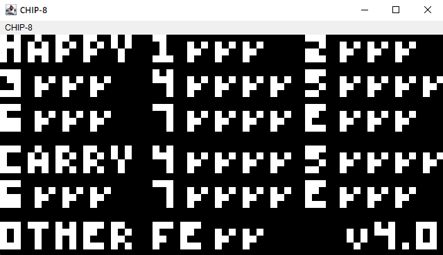
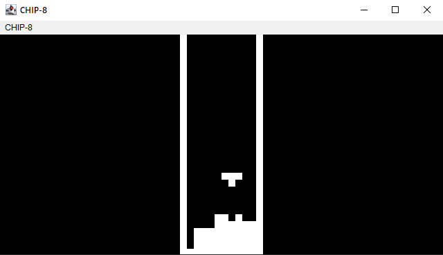

# CHIP-8
Yet another implementation of [CHIP-8](https://en.wikipedia.org/wiki/CHIP-8) in Java + AWT.

## Screenshots

## Controls
This emulator uses standard keyboard map for CHIP-8 emulators these days.

| 1 | 2 | 3 | 4 |
|---|---|---|---|
| Q | W | E | R |
| A | S | D | F |
| Z | X | C | V |

## How to build and run
### Building
`$ gradle build`

### Running
`$ gradle run`
or
`$ java -jar build/chip-8-1.0-SHAPSHOT.jar`

## Okay, but where can I get ROMs?
Idk, maybe use one of these links?
- https://johnearnest.github.io/chip8Archive/
- https://github.com/kripod/chip8-roms

Note: this is an implementation of the original CHIP-8, so don't try to run SCHIP ROMs on it.
But even then, 80% of CHIP-8 ROMs won't work correctly :P